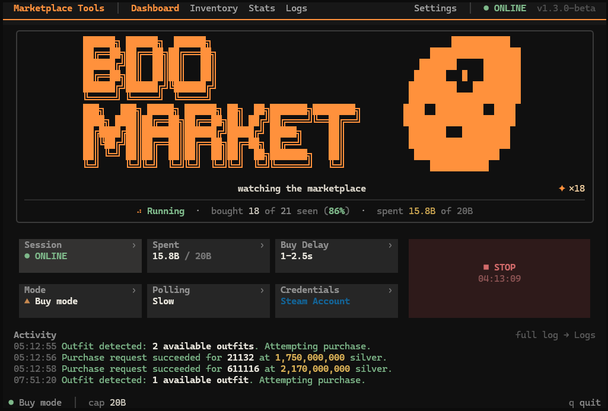
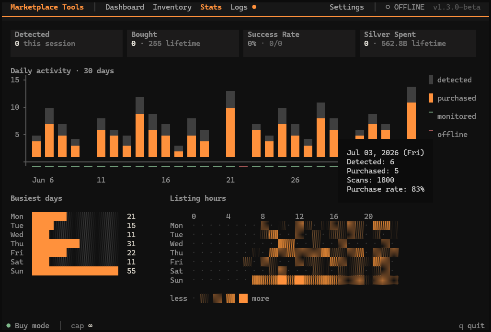

<div align="center">

# Marketplace Tools

<p>
  <a href="https://www.python.org/downloads/">
    
  </a>
  
  
  
</p>

<p>
  
  
  
</p>

</div>

<p align="center">
  A Python terminal application for monitoring and tracking <em>Black Desert Online</em> Central Market outfit listings. Built around an <code>asyncio</code> monitor over the market's HTTP API, with a Textual dashboard and SQLite-backed stats. Watch-only by default; buy mode is opt-in.
</p>

<p align="center">
  
</p>

<p align="center">
  <em>Live dashboard with session state, buy controls, spend cap, and a compact activity feed.</em>
</p>

<p align="center">
  
</p>

<p align="center">
  <em>SQLite-backed stats view for recent detections, purchases, busiest days, listing hours, and monitored/offline days.</em>
</p>

## Features

### Core Capabilities

- **Automatic market monitoring.** Continuously scans independently selectable male/female outfit-box and individual-piece groups at an adjustable interval, with boxes-only, combined, and pieces-only scopes persisted across launches — no manual refreshing required.
- **Watch-only by default.** On launch it only reports what it finds and never spends silver. Buying stays disabled until you explicitly enable it.
- **Optional buy mode.** When enabled, it submits purchase requests as listings appear, bounded by a per-session spend cap you set and a configurable delay between buys.
- **Unified dashboard.** A single live view shows session status, current monitor activity, and a running feed of recent events.
- **Activity and stats tracking.** A dedicated stats page records detections and purchases, busiest days, common listing hours, and the bot's online/offline coverage.
- **Multi-account support.** Works with both Pearl Abyss launcher and Steam accounts (see Account Support below).
- **Inventory view** for stored silver and Value Pack status — currently in progress.

### Technical Features

- **Async concurrency (`asyncio`).** A non-blocking monitoring loop offloads blocking network I/O with `asyncio.to_thread()`, fans out concurrent male/female category scans via `asyncio.gather()`, and serializes session-sensitive requests behind an `asyncio.Lock` — all inside guarded task lifecycles with exponential retry backoff and automatic session-expiry recovery.
- **Direct REST/HTTP API integration.** Interfaces with the BDO Central Market API for public stock scans, wallet lookups, session validation, and authenticated `BuyItem` calls, using isolated `requests.Session` clients for connection pooling and reuse without ever mixing authenticated and unauthenticated state.
- **Custom protocol decoder.** A custom-modified parser unpacks the market's proprietary packed response format, with defensive validation against malformed rows and unexpected payload shapes rather than trusting the wire format.
- **SQLite persistence layer.** Time-series storage with schema versioning and migrations, lifetime aggregate totals, timestamped outfit events, daily scan-coverage tracking, a legacy JSON-to-SQLite data migration, and a single serialized background writer that eliminates write contention.
- **Browser-automation authentication.** Playwright-based (Patchright) automation over persistent, app-owned browser profiles drives Steam / Pearl Abyss login and imports only the marketplace session cookies required — no game credentials ever touched.
- **Secure credential handling.** Optional account passwords are stored in the OS-native keyring, never in plaintext, and used solely to auto-fill the official login page.
- **Safety-gated purchase pipeline.** End-to-end guards — buy-mode confirmation, real-time spend-cap enforcement, actual-price accounting, randomized per-item delay bounds, an observer callback for live purchase telemetry, and a single automatic retry after re-authentication.
- **Reactive Textual TUI.** A terminal UI built on the Textual framework — dashboard modals, hoverable chart tooltips, a filtered event log, and frame-based animations — backed by a 300+ test headless suite that drives the full application end to end.

## Supported

| Category | Details |
| --- | --- |
| **Accounts** | Pearl Abyss launcher · Steam |
| **Region** | NA only |
| **OTP / two-factor** | Not currently supported |

<sub>Last verified June 30, 2026.</sub>

## Running the App

Install dependencies from the repository root:

```powershell
py -3 -m pip install -r requirements.txt
```

On Windows, start the app with:

```powershell
run.bat
```

Or run directly from the repository root:

```powershell
py -3 main.py
```

`run.bat` uses Windows Terminal when available so the Textual UI opens at a usable size. Set `BDO_DISABLE_WT=1` before launching to run in the current console instead.

Runtime data is stored outside the repository by default at `%LOCALAPPDATA%\bdo-marketplace-tools\data`. Set `BDO_DATA_DIR` before launch to use a portable or custom data location.

## Known Issues

- OTP and CAPTCHA challenges are manual. The app can keep the browser open and wait, but it does not automate verification challenges.
- Marketplace endpoints, result codes, and login pages can change without notice. Unknown purchase codes are shown in the event log as `resultCode {code}` so they can be documented after a fresh capture.
- Stats history writes are best effort. If the local SQLite database stays locked after retries, a chart event or scan-coverage marker can be missed while the monitor keeps running.
- Multi-item purchase batches are still committed after the batch returns. A future change will persist and log each successful item as it completes.

## Planned Work

- Marketplace inventory polish.
- Automated pre-order workflow.
- More configurable marketplace categories.

## Disclaimer

This repository is provided for proof-of-concept and educational purposes only. Use it at your own risk; I am not responsible for anything that happens to your account if you choose to use it.

## Contact

For questions or bug reports, use the issue tracker or my Discord: `._.__.__._._.__._____.__._.___.`
